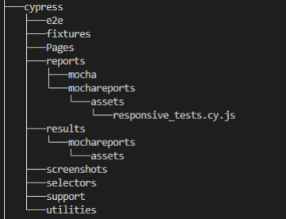

## Setup 🛠️

### Pre-requisites

- Install NodeJS and NPM package manager.
- GIT Bash terminal (for Windows)
- Make sure you have Node.js and npm installed on your computer. I have used the following versions:
  Node (>=v22.9.0)
  Npm (>=10.8.3)
- To check if node and npm version exists in your local machine :
- In command prompt, run below commands

  - `npm -v`
  - `node -v`

### Setup from Scratch

- `npm init` to setup node project with package.json
- `npm install --save-dev cypress` to install cypress as dev dependency. It will install Cypress in the system.
- `npx cypress open` to open the cypress test runner and choose `E2E Testing` which will create cypress config, support, and fixture folders.
- If cypress does not open, gives you error message such as "No version of Cypress is installed in:". Use below command to install cypress once again.
  `npx cypress install --force`

- Install below Commands of Mochawesome reporter for Test Reporting:
- `npm install --save-dev cypress-mochawesome-reporter`
- `npm install --save-dev cypress-multi-reporters`
- `npm install --save-dev mochawesome`
- `npm install --save-dev mochawesome-merge`
- `npm install --save-dev mochawesome-report-generator`

## Configuration ⚙️

- Folder Structure

Project configs are defined under `cypress.config.js`

Test data are stored under `cypress/fixtures/`

- `properties.json`
- `settings.json`

## Running tests

To run your tests in headless mode

- In Vscode, open the terminal. For cross-browser testing, use the following command:

  `npm run test`

This will execute the tests in all installed browser( Chrome, Edge, Firefox)

## Test Reporting 📑

This framework uses cypress-mochawesome-reporter to generate test reports automatically. After test execution,
the report will be saved at:

`cypress/reports/mochareports/report.html`
